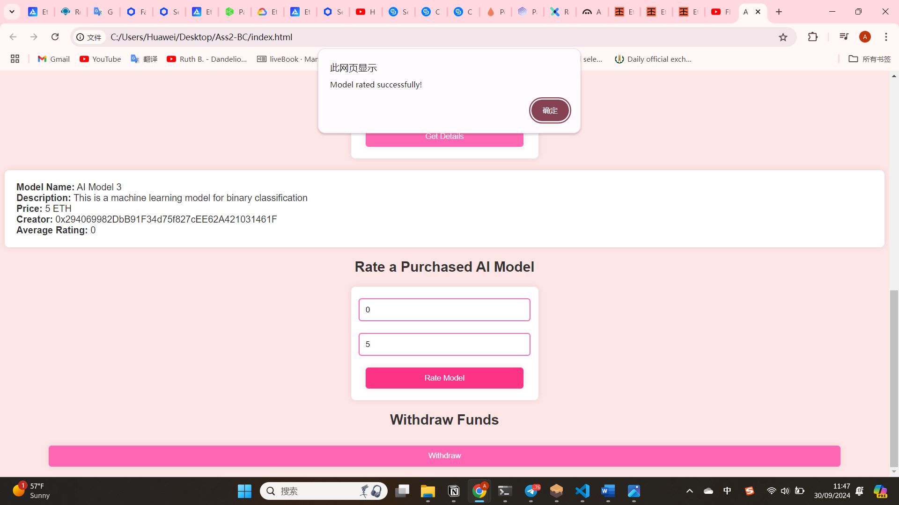

# Title: AI Model Marketplace

## Project Overview
This project is a decentralized AI Model Marketplace built on Ethereum, allowing users to list, purchase, and rate AI models.

## Usage
1. Deploy the contract on an Ethereum testnet(Minato) or Ganache.
2. Interact with the front-end to list, purchase, and rate AI models.

## Demo
Here are screenshots demonstrating the functionality:
# 1

# 2

## Example
- We can interact with the smart contract via the front-end by listing models, purchasing, and withdrawing funds.

## License
This project is licensed under the MIT License - see the [LICENSE](./license.txt) file for details.
